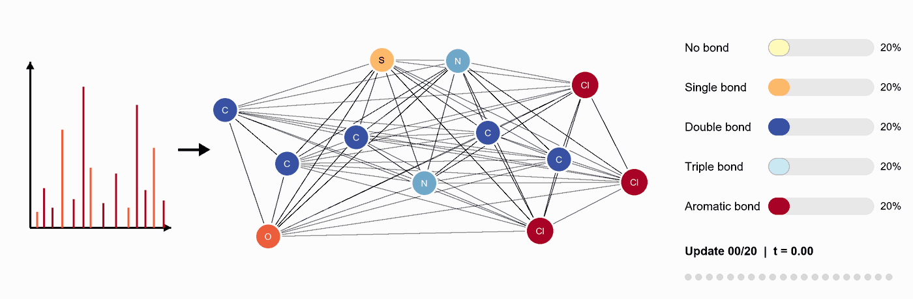
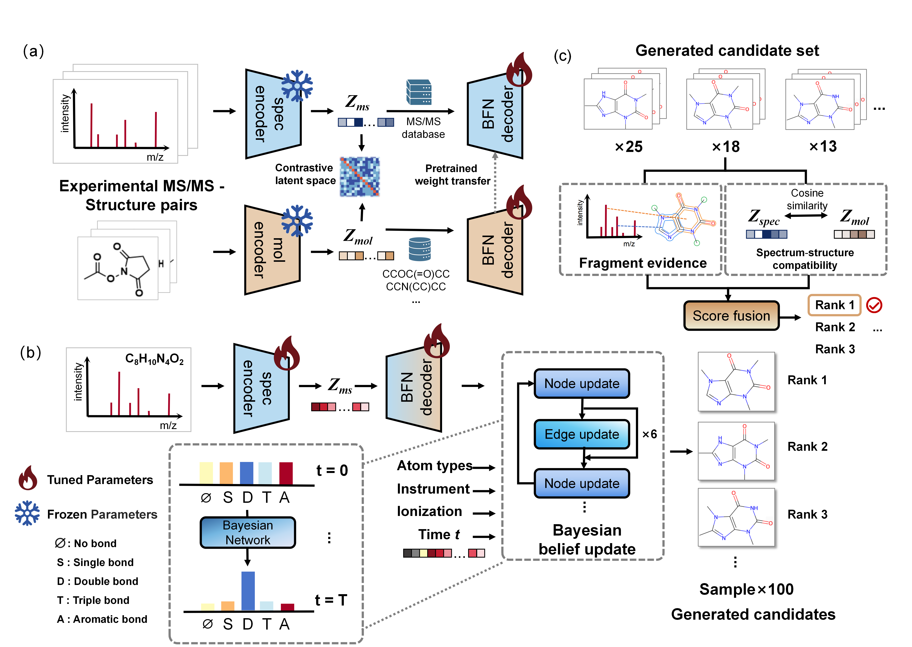

# MS2Forge

<p align="center">
  
</p>

MS2Forge generates molecular structures from tandem mass spectra with a
Bayesian Flow Network (BFN) and ranks generated candidates using fragment
evidence and spectrum--structure compatibility.



## Installation

```bash
conda env create -f environment.yml
conda activate ms2forge
```

The validated environment uses Python 3.9.23, PyTorch 2.3.1, CUDA 11.8,
RDKit 2024.09.4, and PyTorch Geometric 2.3.1. `environment_lock.yml` and
`requirements_freeze.txt` provide exact environment snapshots.

## Quick validation

```bash
python run_test/demo_forward.py --device auto
python -m pytest -q
```

## NPLIB1 demonstration

The repository includes ten NPLIB1 test spectra, peak-level subformula
annotations, a ten-entry Zms cache, and frozen candidate results.

```bash
python examples/nplib1_10/run_demo.py
```

To rerun model inference, provide the MS2Mol and alignment checkpoints:

```bash
export MS2MOL_CKPT=/absolute/path/to/ms2mol.pt
export ALIGN_CKPT=/absolute/path/to/alignment.pt
bash examples/nplib1_10/run_inference.sh
```

## Training

```bash
bash scripts/train_graph2mol_ddp.sh
bash scripts/train_ms2mol_ddp.sh
bash scripts/train_joint_ddp.sh
```

## Inference

```bash
python scripts/sample.py --config configs/sample.yml --batch_size 4
bash scripts/sample_ddp.sh
python scripts/export_rerank_candidates.py --help
```

The EvidenceRank-SSR implementation is located in `rerank/`.

## External artifacts

Training and full inference require separately distributed datasets, caches,
and checkpoints at the paths defined by the YAML configurations:

```text
checkpoints/align.pt
checkpoints/graph2mol.pt
checkpoints/ms2mol.pt
data/cache/zms_v1.pt
data/cache/zmol_v1.pt
data/msg_diffms/
data/pretrain/pretrain_smiles.csv
rerank/artifacts/
```

## Repository structure

```text
assets/       Model architecture figure
configs/      Training and inference configurations
docs/         Code map and reproducibility contract
evaluation/   Frozen evaluation summaries
examples/     Executable real-data demonstration
metadata/     Dataset, cache, and checkpoint provenance
models/       MS2Forge and graph-network modules
rerank/       EvidenceRank-SSR implementation
run_test/     Checkpoint-free architecture test
scripts/      Training, sampling, export, and verification commands
tests/        Release-contract tests
utils/        Data, chemistry, reconstruction, and evaluation utilities
```

## Data attribution

All datasets used in this work are publicly available. The MassSpecGym (MSG)
benchmark was obtained from its public release (Bushuiev et al., NeurIPS 2024)
at [https://huggingface.co/datasets/roman-bushuiev/MassSpecGym](https://huggingface.co/datasets/roman-bushuiev/MassSpecGym)
(code: [https://github.com/pluskal-lab/MassSpecGym](https://github.com/pluskal-lab/MassSpecGym)).
The NPLIB1 dataset (also referred to as CANOPUS, derived from public GNPS
spectra; Goldman et al., 2023) was used with the same train/validation/test
splits as DiffMS and can be reproduced with the data-processing scripts at
[https://github.com/coleygroup/DiffMS](https://github.com/coleygroup/DiffMS).
Spectra for encoder pretraining were assembled using the FragHub
library-integration workflow (Dablanc et al., Anal. Chem. 2024;
[https://github.com/eMetaboHUB/FragHub](https://github.com/eMetaboHUB/FragHub)),
which harmonizes open mass-spectral libraries. For both MSG and NPLIB1 we
adopt the identical data splits as DiffMS to ensure a fair comparison.

## License

This project is released under the MIT License. See `LICENSE`.
